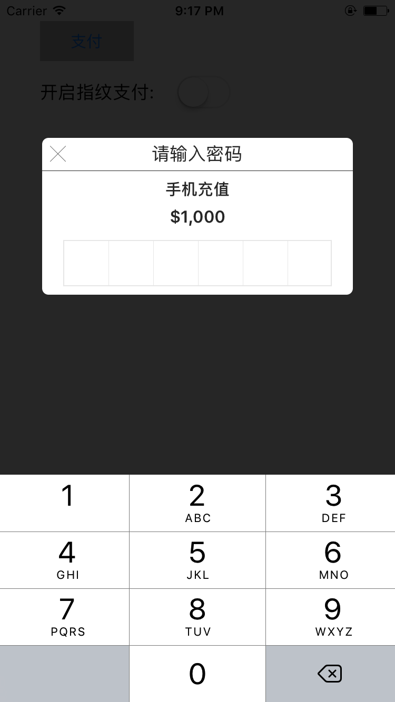
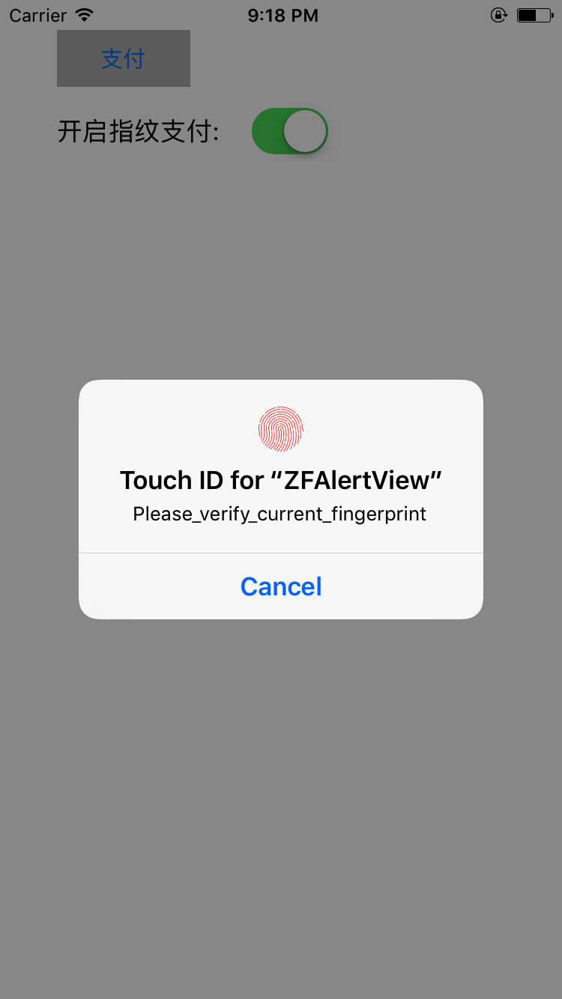
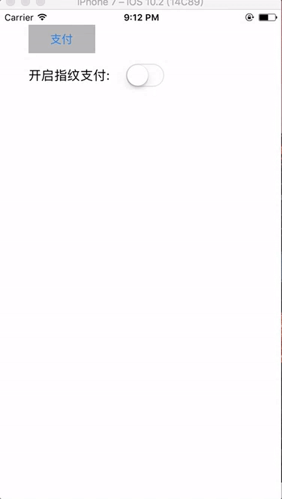

#ZFAlertView
模仿微信密码输入弹框, 集成Touch ID

#Screenshots





#Usage
##ZFPayAlertView
```obj-c
ZFPayAlertView *payAlertView = [[ZFPayAlertView alloc] init];
payAlertView.titleLabel.text = @"请输入密码";
payAlertView.subTitleLabel.text = @"手机充值";
payAlertView.amountLabel.text = @"$1,000";
payAlertView.completeHander  = ^(NSString * password) {
    NSLog(@"password: %@", password);
    [SVProgressHUD show];
    
    dispatch_after(dispatch_time(DISPATCH_TIME_NOW, (int64_t)(3 * NSEC_PER_SEC)), dispatch_get_main_queue(), ^{
        [SVProgressHUD dismiss];
        
        NSString *touchIDConfigure = [[NSUserDefaults standardUserDefaults] objectForKey: touchID_userDefault_key];
        if ([touchIDConfigure isEqualToString:@"Yes"] == NO) {
            NSLog(@"提示用户开启touch id 功能");
            
            UIAlertController *alert = [UIAlertController alertControllerWithTitle:@"提示用户开启touch id 功能" message:@"开启touch id功能, 让您爽的飞起!" preferredStyle:UIAlertControllerStyleAlert];
            
            UIAlertAction *laterAction = [UIAlertAction actionWithTitle:@"以后" style: UIAlertActionStyleDefault handler:^(UIAlertAction * _Nonnull action) {
                NSLog(@"用户以后设置");
            }];
            
            UIAlertAction *setAction = [UIAlertAction actionWithTitle:@"设置" style: UIAlertActionStyleDefault handler:^(UIAlertAction * _Nonnull action) {
                NSLog(@"现在设置");
                
                [self configureTouchID];
            }];
            
            [alert addAction: laterAction];
            [alert addAction: setAction];
            
            [self presentViewController:alert animated:YES completion:nil];
        }
        
    });
};
[payAlertView show];

```

##Touch ID
开启touch ID 功能

```obj-c
[[TouchIDManager shareInstance] configureTouchIDWithSuccessBlock:^{
            NSLog(@"配置成功");
            dispatch_after(dispatch_time(DISPATCH_TIME_NOW, (int64_t)(0.3 * NSEC_PER_SEC)), dispatch_get_main_queue(), ^{
                [self.touchIDSwitch setOn:YES animated:YES];
            });
        } failedBlock:^{
            NSLog(@"配置失败");
            dispatch_after(dispatch_time(DISPATCH_TIME_NOW, (int64_t)(0.3 * NSEC_PER_SEC)), dispatch_get_main_queue(), ^{
                [self.touchIDSwitch setOn:NO animated:YES];
            });
         
        }];
```

如果用户开启touch ID 优先选择指纹支付, 其次使用手动输入密码

```obj-c
if (`判断用户是否开启指纹支付`) {
    [[TouchIDManager shareInstance] verifyTouchIDWithSuccessBlock:^(NSString *password) {
        NSLog(@"验证成功: %@", password);
    } failedBlock:^(NSString *errorMessage) {
        NSLog(@"验证失败: %@", errorMessage);
    } userFallbackBlock:^{
        NSLog(@"用户点击 手动输入密码按钮");
        [self showPayView];
    }];

} else {
    NSLog(@"使用手动输入密码");
    [self showPayView];
}
return;
```
